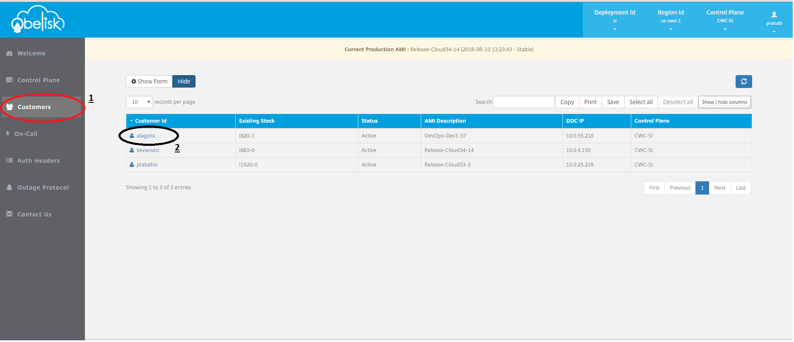
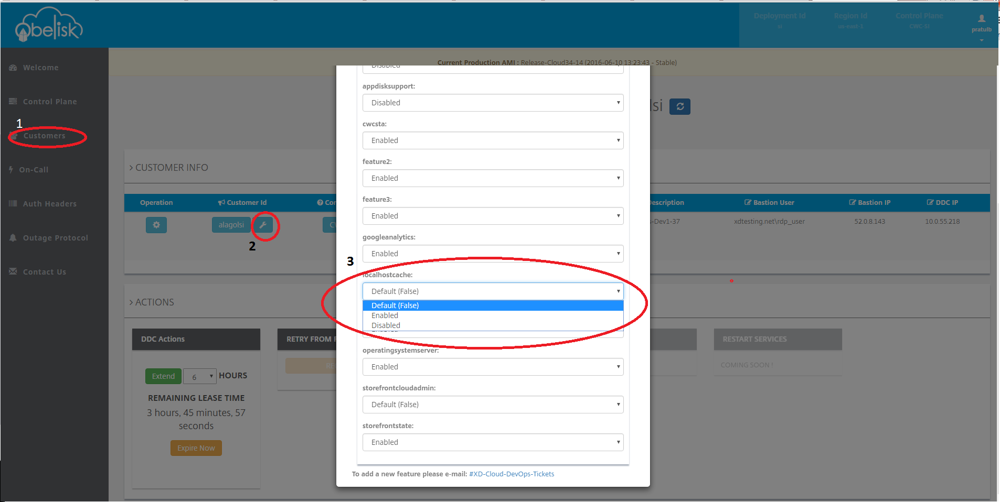

# Feature Toggles

#### Background
Every customer is eligible for certain features which are used by DDC to decide customer's functionality.  
Features can be at:
-Control plane level: Feature in this category applies to all the customer in control plane eg SICP1, Production.
-Edition level: Feature in this category applies to all the customer having same licensing eg Platinum, AzureVDI etc.
-Customer level: Featues in this level are specific to customer.  

All customers are eligible for control plane level features. Edition level features are related to the licensing of the customer. The effective features for customer is merged set of all these features where customer level features take priority over edition level which inturn takes priority over control plane features.  
Each features can have different settings or values which decides characteristics of customer. Settings are case sensitive and values must be string eg {Enabled : "True/False"}.

#### Functionality
Obelisk has mechanism to Enable, Disable or apply default setting for customers. For eg, a feature name "GoogleAnalytics" is enabled at control plane level implies it is eligible for all the customers on that control plane level. If customer has "AzureVDI" licensing and corresponds to "AzureVDI" edition, which inturn has "Enabled: 'False" the effective setting will be false.  
Search for the customer and open its description page. Follow steps as shown in image.

To check all the eligible features, please follow steps 1 and 2 as shown in image:

To change the values, use step 1 in above image

#### Usage
- Values in the dropdown are possible values for the corresponding feature. 
- Choosing Enable/Disable will create or modify settings at customer level which will override lower level settings. 
- Selecting "Default" value will remove the entries from the customer level features and default values which are either at control or edition level will be applied on customer.
